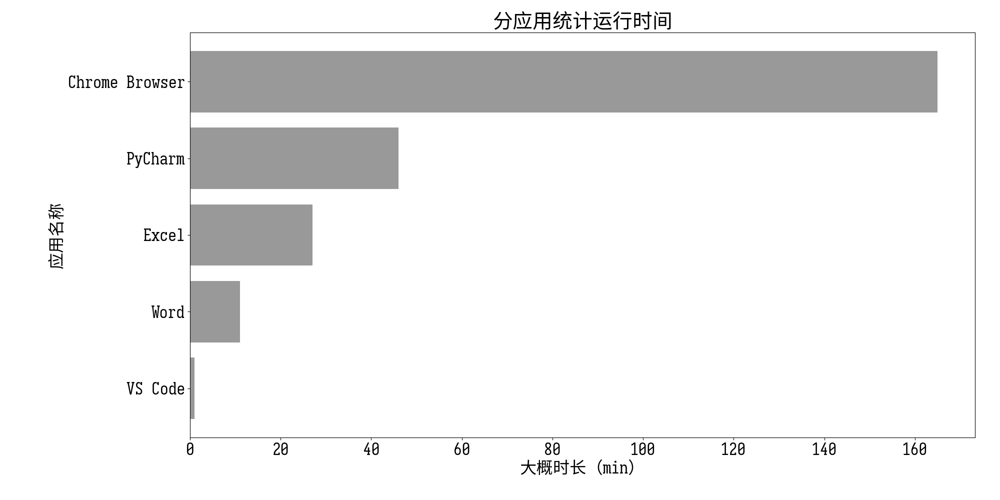
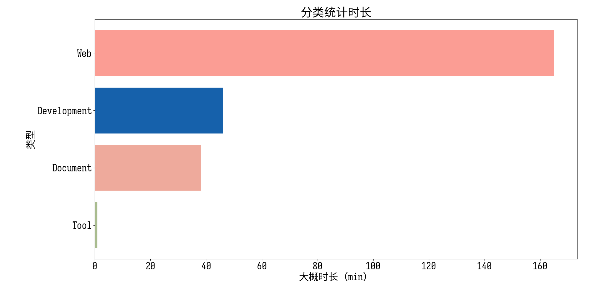

# TimeTracker
Time Tracker | Screen Time | 时间追踪 | 时间跟踪 | 屏幕时间 | For Windows 

简单通过进程粗略地记录每个进程运行的时间，并展示；

## 输出图片 sample

## 特点 features
+ 暂无友好的用户界面 No GUI temporarily
+ 单纯统计进程运行时间 Tracker process Running time simply
+ 暂无定时提醒功能 No time limitation temporarily
+ 可自定义统计进程列表和分类 Custom process name and catalog is available
~~+ 分离语言文件，支持多语言 Localization is available originally via editing json content~~
+ json 编辑跟踪的进程和分类 Track process via json config with name and catalog

## 重要提示 warning
+ 程序仅通过进程名称**粗略地**统计运行程序，不统计具体的程序运行内容（编辑的文件名或是打开的具体网页） 
Only track program **roughly** via process name without detailed file editing or browsing

如有统计更具体信息的需求，可以尝试其他项目/程序：[MayGo/tockler](https://github.com/MayGo/tockler) , 
[RobinWeitzel/WindowsTimeTracker](https://github.com/RobinWeitzel/WindowsTimeTracker), 
[manictime](https://www.manictime.com/) 等

+ 程序暂不支持设定时间限制或到时间提醒 No time limitation or notification temporarily

如有需求可以尝试其他项目/程序：[RoderickQiu/wnr](https://github.com/RoderickQiu/wnr), 番茄钟 等

## 程序设计 designing
+ 每隔一定时间，获取当前运行的进程列表，若存在某个进程，视为上一次统计到本次统计这一时间段，这个进程一直在运行
Get process list regularly, then put the process as always running during this getting and last getting
+ 每次统计将统计结果记录为 json ，并储存到指定目录，指定次数的统计后，绘制为统计图，输出到指定目录
Save every track result as json file in dir, and draw a chart after some tracks
+ 仅在程序开始时检查配置文件是否存在格式问题、指定目录是否能够读写等，更改配制后需要手动结束运行程序再重启，全程不再有任何提示
Check whether the location is accessible and config contain some errors, restart manually is necessary to apply new config, and no other popup
+ 自动将指定时间以前的统计结果打包，便于数据的移动和备份
Auto pack outdated data in order to back up or move them
+ 理论上，一个时间段内，只认为有一个程序在运行
+ 跨日期运行，程序计数时，会将起点不在本日的一个绘图周期的数据计入起点所在的日期
+ 修改 tracker.json 后需要手动重启程序，否则统计遇到新添加的程序可能会报错

